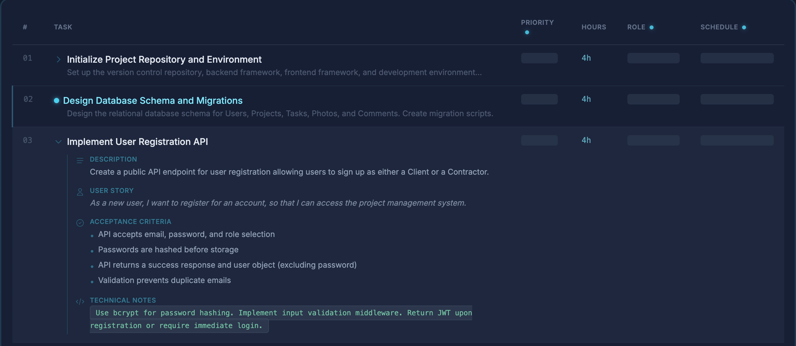
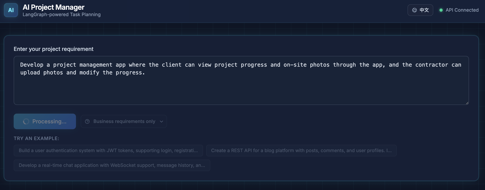
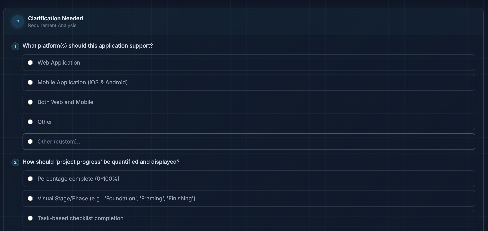
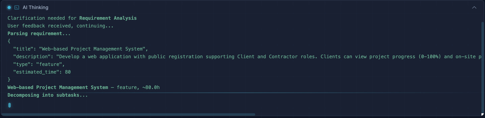

# AI Project Manager Assistant

A LangGraph-powered intelligent project management assistant that transforms natural language requirements into actionable task plans with priority assessment, resource allocation, and timeline scheduling.

## Features

- **Natural Language Processing** - Transform plain text requirements into structured project plans
- **Smart Task Decomposition** - Automatically break down requirements into actionable subtasks
- **Priority Assessment** - AI-powered task prioritization based on dependencies and importance
- **Resource Allocation** - Intelligent team member assignment based on skills and availability
- **Timeline Scheduling** - Automatic Gantt chart generation with dependency tracking
- **Interactive Clarification** - Smart follow-up questions to refine unclear requirements
- **Real-time Streaming** - Live progress visualization with step-by-step workflow tracking
- **Multi-language Support** - English and Chinese interface
- **Export Options** - Export plans to Markdown, JSON, or CSV formats
- **Session Persistence** - Auto-save and restore your work

## Screenshots

### Main Interface

*Task analysis with Gantt chart visualization and team allocation*

### Interactive Chat

*Natural language requirement input with real-time streaming response*

### Clarification Flow

*Smart clarification questions to refine ambiguous requirements*

### Thinking Process

*Transparent AI reasoning process with step-by-step progress tracking*

## Architecture

```
                    ┌──────────────┐
                    │  User Input  │
                    │     Web      │
                    └──────┬───────┘
                           │
                    ┌──────▼───────┐
                    │   Requirement │
                    │    Parser     │
                    └──────┬───────┘
                           │
                    ┌──────▼───────┐
                    │     Task     │
                    │  Decomposer  │
                    └──────┬───────┘
                           │
                    ┌──────▼───────┐
                    │   Priority   │
                    │   Assessor   │
                    └──────┬───────┘
                           │
                    ┌──────▼───────┐
               ┌───▶│   Resource   │
               │    │  Allocator   │
               │    └──────┬───────┘
               │           │
               │    ┌──────▼───────┐
               │    │  Conflict?   │──── No ───┐
               │    └──────┬───────┘           │
               │           │ Yes               │
               │    ┌──────▼───────┐    ┌──────▼───────┐
               └────│  Adjustment  │    │    Output     │
                    │    Loop      │    │   Summary     │
                    └──────────────┘    └──────────────┘
```

## Tech Stack

- **Backend:** Python, LangGraph, LangChain, FastAPI
- **Frontend:** React, TypeScript, Vite, Tailwind CSS v4
- **AI:** OpenAI GPT-4o-mini (configurable)
- **State Management:** LangGraph with streaming support

## Quick Start

### Prerequisites

- Python 3.11+
- Node.js 18+
- OpenAI API key

### Backend Setup

```bash
# Install dependencies
pip install -r backend/requirements.txt

# Configure environment
cp .env.example .env
# Edit .env and add your OPENAI_API_KEY

# Run API server (from project root)
uvicorn backend.api:app --reload --port 8000
```

> **Note:** All commands must be run from the project root directory (`AI-project-manager/`), not from inside `backend/`.

### Frontend Setup

```bash
cd frontend
npm install
npm run dev
```

The frontend runs at `http://localhost:5173` and proxies API requests to `http://localhost:8000`.

## Docker Deployment

This project can be deployed on a single Vultr host with Docker Compose and a host-level nginx reverse proxy.

### Container Layout

- `frontend`: serves the built Vite app with nginx inside the container
- `backend`: runs the FastAPI app with `uvicorn`
- host nginx: listens on `80/443` and proxies this project to `127.0.0.1:18080`

### Server Path

Clone the repository to:

```bash
/projects/AI-Project-Manager-Assistant
```

### Server Requirements

- Docker Engine
- Docker Compose plugin
- A server-local `.env` file in `/projects/AI-Project-Manager-Assistant/.env`
- A GitHub deploy key on the server so `git pull` works for the repository

Example install on Ubuntu:

```bash
sudo apt update
sudo apt install -y ca-certificates curl gnupg
sudo install -m 0755 -d /etc/apt/keyrings
curl -fsSL https://download.docker.com/linux/ubuntu/gpg | sudo gpg --dearmor -o /etc/apt/keyrings/docker.gpg
sudo chmod a+r /etc/apt/keyrings/docker.gpg
echo \
  "deb [arch=$(dpkg --print-architecture) signed-by=/etc/apt/keyrings/docker.gpg] https://download.docker.com/linux/ubuntu \
  $(. /etc/os-release && echo "$VERSION_CODENAME") stable" | \
  sudo tee /etc/apt/sources.list.d/docker.list > /dev/null
sudo apt update
sudo apt install -y docker-ce docker-ce-cli containerd.io docker-buildx-plugin docker-compose-plugin git
```

### First-Time Server Setup

```bash
mkdir -p /projects
cd /projects
git clone <your-repo-ssh-url> AI-Project-Manager-Assistant
cd /projects/AI-Project-Manager-Assistant
cp .env.example .env
# edit .env with your production values
docker compose up -d --build
```

The frontend container is exposed on host port `18080`. The backend is kept private inside the Compose network and is only reachable from the frontend container.

### Host nginx Reverse Proxy

Configure your host-level nginx to forward your public domain to `127.0.0.1:18080`:

```nginx
server {
    listen 80;
    server_name your-domain.example.com;

    location / {
        proxy_pass http://127.0.0.1:18080;
        proxy_http_version 1.1;
        proxy_set_header Host $host;
        proxy_set_header X-Real-IP $remote_addr;
        proxy_set_header X-Forwarded-For $proxy_add_x_forwarded_for;
        proxy_set_header X-Forwarded-Proto $scheme;
        proxy_read_timeout 300s;
        proxy_send_timeout 300s;
    }
}
```

### GitHub Actions Auto-Deploy

On every push to `main`, GitHub Actions SSHes to the server and runs:

```bash
cd /projects/AI-Project-Manager-Assistant
git pull --ff-only origin main
docker compose up -d --build --remove-orphans
```

Add these GitHub repository secrets:

- `VULTR_HOST`
- `VULTR_USER`
- `VULTR_SSH_KEY`
- `VULTR_PORT`

## Project Structure

```
AI-project-manager/
├── backend/
│   ├── config/
│   │   ├── settings.py        # App settings (env-based)
│   │   └── team_config.json   # Default team configuration
│   ├── graph/
│   │   ├── nodes/
│   │   │   ├── requirement_parser.py   # NL -> structured requirement
│   │   │   ├── task_decomposer.py      # Requirement -> subtasks
│   │   │   ├── priority_assessor.py    # Subtasks -> prioritized
│   │   │   ├── resource_allocator.py   # Assign members + schedule
│   │   │   ├── adjustment_loop.py      # Handle resource conflicts
│   │   │   └── output_summary.py       # Generate final output
│   │   ├── state.py            # LangGraph state definition
│   │   └── workflow.py         # LangGraph workflow builder
│   ├── models/
│   │   ├── task.py             # Task/SubTask/Requirement models
│   │   └── team.py             # TeamMember/TeamConfig models
│   ├── api.py                  # FastAPI REST server
│   └── requirements.txt
├── frontend/
│   ├── src/
│   │   ├── components/
│   │   │   ├── Header.tsx          # App header with language switch
│   │   │   ├── RequirementForm.tsx # Input form with streaming
│   │   │   ├── TaskTable.tsx       # Task list view
│   │   │   ├── GanttChart.tsx      # Timeline visualization
│   │   │   ├── SummaryPanel.tsx    # Summary metrics
│   │   │   ├── StepProgress.tsx    # Workflow progress indicator
│   │   │   ├── ThinkingPanel.tsx   # AI reasoning display
│   │   │   ├── ClarificationPanel.tsx # Interactive clarification
│   │   │   └── ExportButton.tsx    # Export functionality
│   │   ├── services/
│   │   │   └── api.ts              # API client with SSE streaming
│   │   ├── i18n/                   # Internationalization
│   │   ├── types/
│   │   │   └── index.ts            # TypeScript types
│   │   ├── utils/
│   │   │   ├── export.ts           # Export utilities
│   │   │   └── persistence.ts      # Session persistence
│   │   ├── App.tsx
│   │   └── main.tsx
│   └── package.json
├── images/                       # Screenshots for documentation
├── .env.example
└── requirements.md
```

## Configuration

### Environment Variables

| Variable | Default | Description |
|----------|---------|-------------|
| `OPENAI_API_KEY` | (required) | OpenAI API key |
| `OPENAI_MODEL` | `gpt-4o-mini` | LLM model to use |
| `OUTPUT_FORMAT` | `markdown` | Default output format |
| `MAX_ADJUSTMENTS` | `3` | Max resource adjustment loops |
| `TEAM_CONFIG_PATH` | `backend/config/team_config.json` | Path to team config |

### Team Configuration

Edit `backend/config/team_config.json` to configure your team:

```json
{
  "members": [
    {
      "name": "Alice",
      "role": "senior_developer",
      "skills": ["python", "react", "architecture"],
      "max_hours_per_week": 40
    }
  ],
  "max_adjustment_iterations": 3
}
```

## Web Interface Features

### Real-time Streaming
- Live progress tracking with visual step indicators
- Progressive task table rendering
- Transparent AI thinking process display

### Interactive Clarification
- Smart follow-up questions for ambiguous requirements
- Multi-choice and text input support
- Context-aware conversation flow

### Visualization
- Gantt chart for timeline view
- Task table with priority and assignment details
- Summary panel with project metrics

### Export Options
- Markdown format for documentation
- JSON for programmatic use
- CSV for spreadsheet import

## License

MIT
